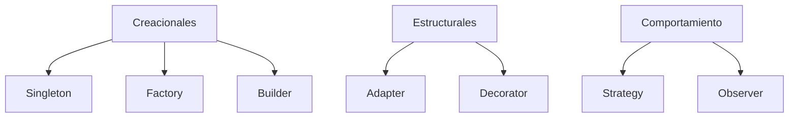

# Nivel 6 — Patrones de Diseño

Los patrones de diseño son **soluciones reutilizables** a problemas comunes
de diseño de software. No son código concreto sino plantillas de solución.

Este mapa te ayuda a ubicar cada patrón antes de estudiar el detalle.

## Categorías

| Categoría | Descripción | Patrones |
|-----------|-------------|---------|
| **Creacionales** | Cómo se crean los objetos | Singleton, Factory, Builder, Prototype |
| **Estructurales** | Cómo se componen las clases | Adapter, Decorator, Facade, Proxy, Composite |
| **Comportamiento** | Cómo interactúan los objetos | Observer, Strategy, Command, Template Method |

## Temas del Nivel

| # | Tema |
|---|------|
| 1 | [Patrones Creacionales](01-creacionales.md) |
| 2 | [Patrones Estructurales](02-estructurales.md) |
| 3 | [Patrones de Comportamiento](03-comportamiento.md) |
| - | [Ejercicios](ejercicios.md) |

## Tiempo estimado

**3 a 4 semanas** dedicando 1-2 horas diarias.
