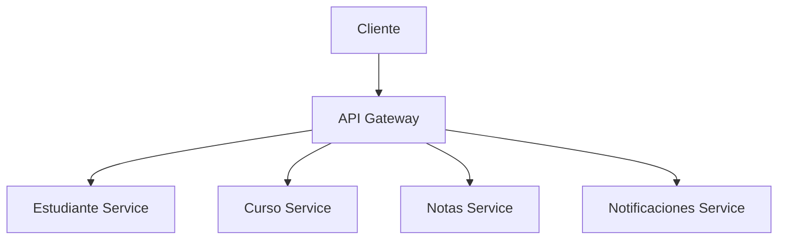

# 7.4 Microservicios

Los microservicios son un estilo arquitectónico donde la aplicación se construye
como un conjunto de **servicios pequeños e independientes**, cada uno ejecutándose
en su propio proceso y comunicándose mediante APIs ligeras (REST/HTTP, mensajería).



Cada servicio tiene su responsabilidad y su base de datos, si aplica.

## Monolito vs Microservicios

```
MONOLITO                          MICROSERVICIOS
+-------------------------+       +----------+  +----------+
|   Aplicación Escolar    |       |Estudiante|  |  Cursos  |
|                         |       |  Service |  |  Service |
|  [Estudiantes]          |       +----------+  +----------+
|  [Cursos]               |            |              |
|  [Calificaciones]       |       +----------+  +----------+
|  [Notificaciones]       |       |  Notas   |  |Notifica- |
|  [Reportes]             |       |  Service |  |  ciones  |
+-------------------------+       +----------+  +----------+
        |                              |              |
    [Una DB]                      [DB Notas]    [DB Cursos]
```

---

## Características de los Microservicios

| Característica | Descripción |
|----------------|-------------|
| **Despliegue independiente** | Cada servicio se despliega por separado |
| **Base de datos propia** | Cada servicio tiene su propia BD |
| **Comunicación via API** | HTTP/REST, gRPC, o mensajería asíncrona |
| **Responsabilidad única** | Un servicio = un contexto de negocio |
| **Fallos aislados** | Un servicio caído no tumba los demás |

---

## Diseño del Sistema Escolar como Microservicios

```
cliente (navegador / app móvil)
          |
    [API Gateway]  — punto único de entrada, enruta peticiones
          |
    +-----+-------+-------+-------+
    |     |       |       |       |
[Estu- [Cur- [Califi- [Noti- [Reporte
diante] sos] caciones] ficac.] Servicio]
    |     |       |       |       |
   BD1   BD2     BD3     BD4     BD5
```

### Estudiante Microservicio (ejemplo)

```java
// Cada microservicio es una aplicación Java independiente
// (típicamente con Spring Boot)

// EstudianteApplication.java
@SpringBootApplication
public class EstudianteApplication {
    public static void main(String[] args) {
        SpringApplication.run(EstudianteApplication.class, args);
    }
}

// EstudianteController.java — REST API
@RestController
@RequestMapping("/api/estudiantes")
public class EstudianteController {
    private final EstudianteServicio servicio;

    public EstudianteController(EstudianteServicio servicio) {
        this.servicio = servicio;
    }

    @GetMapping("/{legajo}")
    public ResponseEntity<Estudiante> obtener(@PathVariable int legajo) {
        return servicio.buscar(legajo)
            .map(ResponseEntity::ok)
            .orElse(ResponseEntity.notFound().build());
    }

    @PostMapping
    public ResponseEntity<Estudiante> crear(@RequestBody EstudianteDTO dto) {
        Estudiante nuevo = servicio.registrar(dto);
        return ResponseEntity.status(201).body(nuevo);
    }

    @GetMapping
    public List<Estudiante> listar(@RequestParam(required = false) String carrera) {
        if (carrera != null) return servicio.buscarPorCarrera(carrera);
        return servicio.listarTodos();
    }
}
```

### Comunicación entre microservicios

```java
// Servicio de Notas llama al Servicio de Estudiantes para validar que existe
@Service
public class NotasServicio {
    private final RestTemplate restTemplate; // cliente HTTP

    public NotasServicio(RestTemplate restTemplate) {
        this.restTemplate = restTemplate;
    }

    public void registrarNota(int legajo, double nota, String codigoMateria) {
        // Validar que el estudiante existe (llamada al otro microservicio)
        try {
            restTemplate.getForObject(
                "http://estudiante-service/api/estudiantes/" + legajo,
                Object.class
            );
        } catch (Exception e) {
            throw new RuntimeException("Estudiante " + legajo + " no encontrado.");
        }

        // Registrar la nota en nuestra BD
        // ...
    }
}
```

---

## Pros y Contras

| Pros | Contras |
|------|---------|
| Escalado independiente | Complejidad operacional mayor |
| Deploy independiente | Latencia de red entre servicios |
| Tecnología heterogénea | Consistencia de datos distribuida |
| Fallos aislados | Más infraestructura necesaria |
| Equipos autónomos | Testing de integración complejo |

---

## ¿Cuándo usar Microservicios?

**SÍ, cuando:**
- El equipo es grande (múltiples equipos)
- Partes del sistema tienen requisitos de escalado muy diferentes
- Diferentes partes evolucionan a ritmos distintos
- Ya se tiene madurez con el monolito

**NO, cuando:**
- El equipo es pequeño
- El dominio no está bien entendido todavía
- Es un proyecto nuevo (empieza con un monolito bien estructurado)

> **Regla de oro:** "Monolito primero". Construye un monolito modular y bien
> estructurado. Cuando veas límites naturales de servicios y problemas reales
> de escala, extrae microservicios.

---

**Siguiente:** [Nivel 8 — Testing](../nivel8-testing/README.md)
