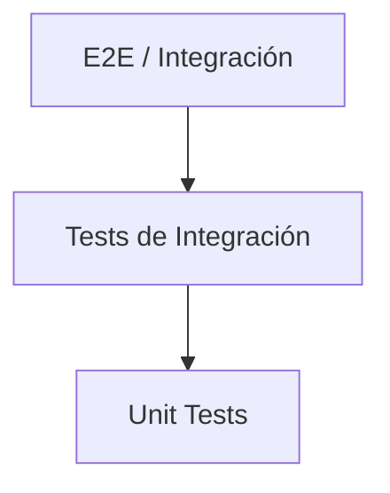

# Nivel 8 — Testing

El testing es la práctica de verificar que el software funciona correctamente.
Un buen conjunto de tests da confianza para refactorizar y agregar funcionalidades.

## Pirámide de Testing



La regla es simple: muchos tests unitarios, menos de integración y muy pocos E2E.

```
         /\
        /  \       E2E / Integración
       /----\      (pocos, lentos, costosos)
      /      \
     /--------\    Tests de Integración
    /          \
   /------------\  Unit Tests
  /              \  (muchos, rápidos, baratos)
```

## Temas del Nivel

| # | Tema |
|---|------|
| 1 | [JUnit 5](01-junit5.md) |
| 2 | [Mockito](02-mockito.md) |
| 3 | [TDD](03-tdd.md) |
| - | [Ejercicios](ejercicios.md) |

## Tiempo estimado

**3 a 4 semanas** dedicando 1-2 horas diarias.
