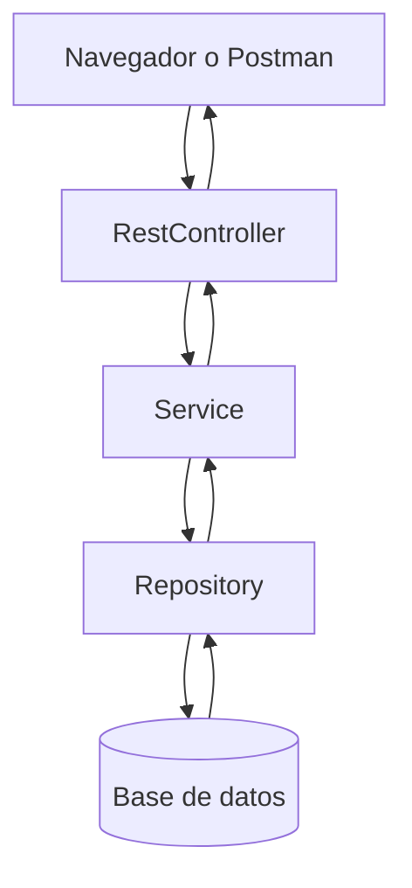

# 9.2 Spring Boot — Introducción

Spring Boot es el paso final de esta ruta porque junta todo lo aprendido antes:
Java, POO, colecciones, testing, arquitectura y persistencia.

Su objetivo es hacer más fácil crear aplicaciones web y APIs REST.

## ¿Qué es Spring?

Spring es un framework que provee:
- **IoC (Inversion of Control)** — el framework controla la creación de objetos
- **DI (Dependency Injection)** — inyecta dependencias automáticamente
- **AOP (Aspect-Oriented Programming)** — para logging, seguridad, transacciones
- **Módulos** para web, datos, seguridad, mensajería, etc.

Spring Boot agrega configuración automática y reduce el código repetitivo.



Este flujo resume la idea de Spring Boot: una petición entra, pasa por capas simples y vuelve como respuesta.

## Ruta de aprendizaje de Spring Boot

Para que sea fácil de entender, conviene aprenderlo en este orden:

1. Crear un proyecto
2. Entender `@SpringBootApplication`
3. Crear un `@RestController`
4. Usar `@Service` y `@Repository`
5. Conectar con base de datos
6. Validar datos
7. Probar la API
8. Agregar seguridad básica

---

## Primer ejemplo muy simple

Este es el ejemplo más pequeño posible de una API:

```java
import org.springframework.web.bind.annotation.GetMapping;
import org.springframework.web.bind.annotation.RestController;

@RestController
public class HolaController {

    @GetMapping("/hola")
    public String saludar() {
        return "Hola desde Spring Boot";
    }
}
```

Si visitas `/hola`, la API responde un texto simple. Ese es el punto de partida.

---

## Crear un proyecto Spring Boot

La forma más fácil es usar [start.spring.io](https://start.spring.io/).

### pom.xml con Spring Boot

```xml
<parent>
    <groupId>org.springframework.boot</groupId>
    <artifactId>spring-boot-starter-parent</artifactId>
    <version>3.2.0</version>
</parent>

<dependencies>
    <!-- Web (incluye Tomcat embebido) -->
    <dependency>
        <groupId>org.springframework.boot</groupId>
        <artifactId>spring-boot-starter-web</artifactId>
    </dependency>

    <!-- JPA + Hibernate -->
    <dependency>
        <groupId>org.springframework.boot</groupId>
        <artifactId>spring-boot-starter-data-jpa</artifactId>
    </dependency>

    <!-- Base de datos H2 (en memoria, para desarrollo) -->
    <dependency>
        <groupId>com.h2database</groupId>
        <artifactId>h2</artifactId>
        <scope>runtime</scope>
    </dependency>

    <!-- Tests -->
    <dependency>
        <groupId>org.springframework.boot</groupId>
        <artifactId>spring-boot-starter-test</artifactId>
        <scope>test</scope>
    </dependency>
</dependencies>
```

---

## IoC y DI — El corazón de Spring

Spring gestiona un contenedor de objetos llamado **ApplicationContext**.
Los objetos gestionados por Spring se llaman **Beans**.

```java
@Repository
public class EstudianteRepositorio {
    // Spring la crea y la administra
}

@Service
public class EstudianteServicio {
    private final EstudianteRepositorio repositorio;

    public EstudianteServicio(EstudianteRepositorio repositorio) {
        this.repositorio = repositorio;
    }
}
```

---

## REST Controller

```java
import org.springframework.web.bind.annotation.*;
import java.util.List;

@RestController                           // @Controller + @ResponseBody
@RequestMapping("/api/estudiantes")      // URL base para todos los métodos
public class EstudianteController {

    private final EstudianteServicio servicio;

    public EstudianteController(EstudianteServicio servicio) {
        this.servicio = servicio;
    }

    // GET /api/estudiantes
    @GetMapping
    public List<Estudiante> listar() {
        return servicio.listarTodos();
    }

    // POST /api/estudiantes
    @PostMapping
    public Estudiante crear(@RequestBody Estudiante estudiante) {
        return servicio.guardar(estudiante);
    }
}
```

> **Idea clave:** primero aprendé a responder un texto, después una lista de objetos, y por último operaciones CRUD completas.

---

## Configuración con application.properties

```properties
# Puerto del servidor (default: 8080)
server.port=8080

# Nombre de la aplicación
spring.application.name=sistema-escolar

# Base de datos H2 en memoria (para desarrollo)
spring.datasource.url=jdbc:h2:mem:escueladb
spring.datasource.driverClassName=org.h2.Driver
spring.datasource.username=sa
spring.datasource.password=

# JPA/Hibernate
spring.jpa.database-platform=org.hibernate.dialect.H2Dialect
spring.jpa.hibernate.ddl-auto=create-drop
spring.jpa.show-sql=true

# Consola H2 accesible en /h2-console
spring.h2.console.enabled=true

# Log level
logging.level.com.escuela=DEBUG
```

Con esta configuración ya podés arrancar una aplicación simple y verla en el navegador o en Postman.

---

## Entidad JPA

```java
import jakarta.persistence.*;

@Entity                              // Esta clase es una tabla en la BD
@Table(name = "estudiantes")        // Nombre de la tabla
public class Estudiante {

    @Id                             // Clave primaria
    @GeneratedValue(strategy = GenerationType.IDENTITY)  // Auto-increment
    private int legajo;

    @Column(nullable = false, length = 100)  // Columna con restricciones
    private String nombre;

    @Column(nullable = false, length = 100)
    private String apellido;

    @Column(unique = true, nullable = false)
    private String email;

    @Column(length = 50)
    private String carrera;

    private double promedio;
    private boolean activo = true;

    // JPA requiere constructor sin argumentos
    protected Estudiante() { }

    public Estudiante(String nombre, String apellido, String email, String carrera) {
        this.nombre = nombre;
        this.apellido = apellido;
        this.email = email;
        this.carrera = carrera;
        this.activo = true;
    }

    // Getters y setters...
}
```

---

## Spring Data JPA Repository

```java
import org.springframework.data.jpa.repository.JpaRepository;
import org.springframework.data.jpa.repository.Query;
import org.springframework.stereotype.Repository;

@Repository
public interface EstudianteRepository extends JpaRepository<Estudiante, Integer> {
    // Spring genera automáticamente el SQL para estos métodos:

    Optional<Estudiante> findByEmail(String email);
    List<Estudiante> findByCarrera(String carrera);
    List<Estudiante> findByActivoTrue();
    List<Estudiante> findByPromedioGreaterThanEqual(double promedio);
    List<Estudiante> findByNombreContainingIgnoreCase(String nombre);

    // Query personalizada con JPQL
    @Query("SELECT e FROM Estudiante e WHERE e.promedio >= :min AND e.carrera = :carrera")
    List<Estudiante> buscarAprobadosPorCarrera(double min, String carrera);

    // Query nativa SQL
    @Query(value = "SELECT * FROM estudiantes WHERE activo = true ORDER BY promedio DESC LIMIT 10",
           nativeQuery = true)
    List<Estudiante> top10PorPromedio();
}

// El servicio usa el repositorio
@Service
public class EstudianteServicioImpl {
    private final EstudianteRepository repo;

    public EstudianteServicioImpl(EstudianteRepository repo) {
        this.repo = repo;
    }

    public Estudiante registrar(String nombre, String apellido, String email, String carrera) {
        if (repo.findByEmail(email).isPresent())
            throw new IllegalStateException("Ya existe un estudiante con ese email.");
        return repo.save(new Estudiante(nombre, apellido, email, carrera));
    }

    public List<Estudiante> obtenerAprobados() {
        return repo.findByPromedioGreaterThanEqual(6.0);
    }
}
```

---

## Punto de entrada

```java
import org.springframework.boot.SpringApplication;
import org.springframework.boot.autoconfigure.SpringBootApplication;

@SpringBootApplication   // @Configuration + @EnableAutoConfiguration + @ComponentScan
public class SistemaEscolarApplication {
    public static void main(String[] args) {
        SpringApplication.run(SistemaEscolarApplication.class, args);
        // Listo! El servidor inicia en http://localhost:8080
    }
}
```

---

## Resumen Spring Boot

| Anotación | Descripción |
|-----------|-------------|
| `@SpringBootApplication` | Punto de entrada principal |
| `@RestController` | Controlador REST (devuelve JSON) |
| `@Service` | Bean de lógica de negocio |
| `@Repository` | Bean de acceso a datos |
| `@Autowired` | Inyección de dependencia |
| `@GetMapping`, `@PostMapping` | Mapear métodos HTTP |
| `@PathVariable` | Variable en la URL |
| `@RequestBody` | Cuerpo de la petición JSON |
| `@Entity` | Clase mapeada a tabla |
| `JpaRepository` | Operaciones CRUD automáticas |

## Ejercicios de Spring Boot

### Ejercicio 1
Crear un endpoint `GET /saludo` que devuelva un texto simple.

### Ejercicio 2
Crear un `POST /estudiantes` que reciba un estudiante y lo devuelva.

### Ejercicio 3
Crear un repositorio con `JpaRepository` para listar estudiantes.

### Ejercicio 4
Agregar validaciones simples al estudiante con `@NotNull` y `@Email`.

### Ejercicio 5
Armar una mini API del sistema escolar con:
- estudiantes
- cursos
- inscripciones

**Siguiente:** [9.3 Bases de Datos con Java](03-bases-datos.md)
