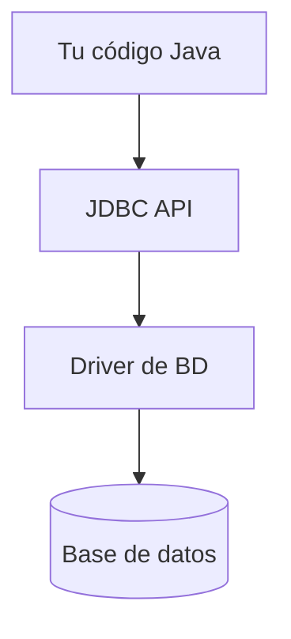
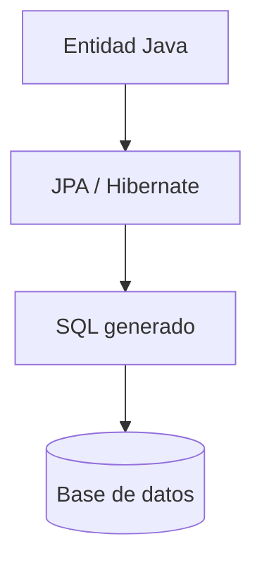

# 9.3 Bases de Datos con Java

> **Nivel:** Ecosistema | **Prerequisitos:** Nivel 3 (Colecciones, Excepciones), Nivel 2 (POO)

Conectar Java a una base de datos es una habilidad fundamental. Veremos desde el nivel más bajo (JDBC) hasta abstracciones modernas (JPA/Hibernate), siempre usando el sistema escolar como ejemplo.

---

## Tabla de contenidos

- [JDBC — La base de todo](#jdbc)
- [Configuración con Maven](#configuracion-maven)
- [Conexión y operaciones básicas](#conexion-basica)
- [PreparedStatement — Evitar SQL Injection](#prepared-statement)
- [Patrón DAO](#patron-dao)
- [JPA e Hibernate — ORM](#jpa-hibernate)
- [Entidades y anotaciones JPA](#entidades-jpa)
- [EntityManager — CRUD con JPA](#entity-manager)
- [Spring Data JPA (intro)](#spring-data-jpa)
- [Transacciones](#transacciones)
- [Errores comunes](#errores-comunes)

---

## JDBC — La base de todo {#jdbc}

**JDBC** (Java Database Connectivity) es la API estándar de Java para conectarse a bases de datos relacionales. Es de bajo nivel pero importante entenderla.



El recorrido siempre es el mismo: tu código habla con JDBC, JDBC usa el driver y el driver se comunica con la base.

```
Tu código Java
      ↓
  JDBC API
      ↓
 JDBC Driver (específico de la BD)
      ↓
  Base de Datos (MySQL, PostgreSQL, H2...)
```

---

## Configuración con Maven {#configuracion-maven}

Agregá las dependencias según tu base de datos:

```xml
<!-- pom.xml -->

<!-- H2 (base de datos en memoria, ideal para desarrollo/tests) -->
<dependency>
    <groupId>com.h2database</groupId>
    <artifactId>h2</artifactId>
    <version>2.2.224</version>
</dependency>

<!-- MySQL -->
<dependency>
    <groupId>com.mysql</groupId>
    <artifactId>mysql-connector-j</artifactId>
    <version>8.3.0</version>
</dependency>

<!-- PostgreSQL -->
<dependency>
    <groupId>org.postgresql</groupId>
    <artifactId>postgresql</artifactId>
    <version>42.7.2</version>
</dependency>

<!-- Para usar JPA/Hibernate -->
<dependency>
    <groupId>org.hibernate.orm</groupId>
    <artifactId>hibernate-core</artifactId>
    <version>6.4.4.Final</version>
</dependency>
```

---

## Conexión y operaciones básicas {#conexion-basica}

### Estructura básica de JDBC

Siempre seguís estos pasos:
1. Obtener una `Connection`
2. Crear un `Statement` o `PreparedStatement`
3. Ejecutar la query
4. Procesar el `ResultSet` (si hay resultados)
5. Cerrar recursos (con try-with-resources)

```java
import java.sql.*;

public class ConexionBasica {

    // URL de conexión (ejemplo con H2 en memoria)
    private static final String URL = "jdbc:h2:mem:escuela;DB_CLOSE_DELAY=-1";
    private static final String USER = "sa";
    private static final String PASSWORD = "";

    public static void main(String[] args) {
        // try-with-resources cierra la conexión automáticamente
        try (Connection conn = DriverManager.getConnection(URL, USER, PASSWORD)) {

            System.out.println("Conexión exitosa: " + conn.getMetaData().getDatabaseProductName());

            // Crear tabla
            crearTabla(conn);

            // Insertar datos
            insertarEstudiante(conn, "Ana García", "ana@escuela.com", 20);
            insertarEstudiante(conn, "Carlos López", "carlos@escuela.com", 22);

            // Consultar datos
            listarEstudiantes(conn);

        } catch (SQLException e) {
            System.err.println("Error de base de datos: " + e.getMessage());
            e.printStackTrace();
        }
    }

    private static void crearTabla(Connection conn) throws SQLException {
        String sql = """
            CREATE TABLE IF NOT EXISTS estudiantes (
                id BIGINT AUTO_INCREMENT PRIMARY KEY,
                nombre VARCHAR(100) NOT NULL,
                email VARCHAR(150) UNIQUE NOT NULL,
                edad INT,
                fecha_registro TIMESTAMP DEFAULT CURRENT_TIMESTAMP
            )
            """;

        try (Statement stmt = conn.createStatement()) {
            stmt.execute(sql);
            System.out.println("Tabla creada.");
        }
    }

    private static void insertarEstudiante(Connection conn, String nombre,
                                            String email, int edad) throws SQLException {
        // Nunca uses concatenación de strings para SQL — usá PreparedStatement
        String sql = "INSERT INTO estudiantes (nombre, email, edad) VALUES (?, ?, ?)";

        try (PreparedStatement ps = conn.prepareStatement(sql,
                Statement.RETURN_GENERATED_KEYS)) {
            ps.setString(1, nombre);
            ps.setString(2, email);
            ps.setInt(3, edad);

            int filas = ps.executeUpdate();
            System.out.println("Insertadas " + filas + " fila(s).");

            // Obtener el ID generado
            try (ResultSet keys = ps.getGeneratedKeys()) {
                if (keys.next()) {
                    System.out.println("ID generado: " + keys.getLong(1));
                }
            }
        }
    }

    private static void listarEstudiantes(Connection conn) throws SQLException {
        String sql = "SELECT id, nombre, email, edad FROM estudiantes ORDER BY nombre";

        try (Statement stmt = conn.createStatement();
             ResultSet rs = stmt.executeQuery(sql)) {

            System.out.println("\n--- Estudiantes ---");
            while (rs.next()) {
                long id = rs.getLong("id");
                String nombre = rs.getString("nombre");
                String email = rs.getString("email");
                int edad = rs.getInt("edad");

                System.out.printf("ID: %d | %s | %s | %d años%n",
                        id, nombre, email, edad);
            }
        }
    }
}
```

> **Tip:** Siempre usá `try-with-resources` para `Connection`, `Statement` y `ResultSet`. De lo contrario tendrás memory leaks y conexiones colgadas.

---

## PreparedStatement — Evitar SQL Injection {#prepared-statement}

### El peligro de concatenar strings

```java
// ❌ NUNCA hagas esto — vulnerable a SQL Injection
String nombre = request.getParameter("nombre"); // input del usuario
String sql = "SELECT * FROM estudiantes WHERE nombre = '" + nombre + "'";
// Si nombre = "'; DROP TABLE estudiantes; --" → ¡desastre!

// ✅ SIEMPRE usá PreparedStatement con parámetros (?)
String sql = "SELECT * FROM estudiantes WHERE nombre = ?";
PreparedStatement ps = conn.prepareStatement(sql);
ps.setString(1, nombre); // JDBC escapa los caracteres peligrosos
```

### Búsqueda por criterios

```java
public List<Estudiante> buscarPorNombreYEdad(Connection conn,
                                              String nombre, int edadMin) throws SQLException {
    String sql = """
        SELECT id, nombre, email, edad
        FROM estudiantes
        WHERE nombre LIKE ?
          AND edad >= ?
        ORDER BY nombre
        """;

    List<Estudiante> resultado = new ArrayList<>();

    try (PreparedStatement ps = conn.prepareStatement(sql)) {
        ps.setString(1, "%" + nombre + "%");  // LIKE con wildcards
        ps.setInt(2, edadMin);

        try (ResultSet rs = ps.executeQuery()) {
            while (rs.next()) {
                resultado.add(mapearEstudiante(rs));
            }
        }
    }

    return resultado;
}

private Estudiante mapearEstudiante(ResultSet rs) throws SQLException {
    return new Estudiante(
        rs.getLong("id"),
        rs.getString("nombre"),
        rs.getString("email"),
        rs.getInt("edad")
    );
}
```

---

## Patrón DAO {#patron-dao}

El patrón **DAO** (Data Access Object) separa la lógica de acceso a datos del resto de la aplicación. Es fundamental para un código limpio y testeable.

### Estructura del patrón

```
EstudianteDAO (interface)
      ↑
EstudianteDAOImpl (implementación JDBC)
      ↑
EstudianteService (lógica de negocio — no sabe de SQL)
```

### Clase de modelo

```java
public class Estudiante {
    private Long id;
    private String nombre;
    private String email;
    private int edad;

    // Constructor completo
    public Estudiante(Long id, String nombre, String email, int edad) {
        this.id = id;
        this.nombre = nombre;
        this.email = email;
        this.edad = edad;
    }

    // Constructor sin ID (para inserciones)
    public Estudiante(String nombre, String email, int edad) {
        this(null, nombre, email, edad);
    }

    // Getters y setters...
    public Long getId() { return id; }
    public void setId(Long id) { this.id = id; }
    public String getNombre() { return nombre; }
    public String getEmail() { return email; }
    public int getEdad() { return edad; }

    @Override
    public String toString() {
        return "Estudiante{id=%d, nombre='%s', email='%s', edad=%d}"
                .formatted(id, nombre, email, edad);
    }
}
```

### Interface DAO

```java
import java.util.List;
import java.util.Optional;

public interface EstudianteDAO {
    Estudiante guardar(Estudiante estudiante);
    Optional<Estudiante> buscarPorId(Long id);
    Optional<Estudiante> buscarPorEmail(String email);
    List<Estudiante> buscarTodos();
    List<Estudiante> buscarPorNombre(String nombre);
    Estudiante actualizar(Estudiante estudiante);
    void eliminar(Long id);
    int contarTotal();
}
```

### Implementación con JDBC

```java
import java.sql.*;
import java.util.*;

public class EstudianteDAOImpl implements EstudianteDAO {

    private final Connection connection;

    public EstudianteDAOImpl(Connection connection) {
        this.connection = connection;
    }

    @Override
    public Estudiante guardar(Estudiante estudiante) {
        String sql = "INSERT INTO estudiantes (nombre, email, edad) VALUES (?, ?, ?)";

        try (PreparedStatement ps = connection.prepareStatement(sql,
                Statement.RETURN_GENERATED_KEYS)) {

            ps.setString(1, estudiante.getNombre());
            ps.setString(2, estudiante.getEmail());
            ps.setInt(3, estudiante.getEdad());
            ps.executeUpdate();

            try (ResultSet keys = ps.getGeneratedKeys()) {
                if (keys.next()) {
                    estudiante.setId(keys.getLong(1));
                }
            }

            return estudiante;

        } catch (SQLException e) {
            throw new RuntimeException("Error al guardar estudiante", e);
        }
    }

    @Override
    public Optional<Estudiante> buscarPorId(Long id) {
        String sql = "SELECT * FROM estudiantes WHERE id = ?";

        try (PreparedStatement ps = connection.prepareStatement(sql)) {
            ps.setLong(1, id);

            try (ResultSet rs = ps.executeQuery()) {
                if (rs.next()) {
                    return Optional.of(mapear(rs));
                }
                return Optional.empty();
            }

        } catch (SQLException e) {
            throw new RuntimeException("Error al buscar estudiante por ID", e);
        }
    }

    @Override
    public List<Estudiante> buscarTodos() {
        String sql = "SELECT * FROM estudiantes ORDER BY nombre";
        List<Estudiante> lista = new ArrayList<>();

        try (Statement stmt = connection.createStatement();
             ResultSet rs = stmt.executeQuery(sql)) {

            while (rs.next()) {
                lista.add(mapear(rs));
            }

        } catch (SQLException e) {
            throw new RuntimeException("Error al listar estudiantes", e);
        }

        return lista;
    }

    @Override
    public Estudiante actualizar(Estudiante estudiante) {
        String sql = "UPDATE estudiantes SET nombre = ?, email = ?, edad = ? WHERE id = ?";

        try (PreparedStatement ps = connection.prepareStatement(sql)) {
            ps.setString(1, estudiante.getNombre());
            ps.setString(2, estudiante.getEmail());
            ps.setInt(3, estudiante.getEdad());
            ps.setLong(4, estudiante.getId());

            int filas = ps.executeUpdate();
            if (filas == 0) {
                throw new RuntimeException("No se encontró el estudiante con ID: " + estudiante.getId());
            }

            return estudiante;

        } catch (SQLException e) {
            throw new RuntimeException("Error al actualizar estudiante", e);
        }
    }

    @Override
    public void eliminar(Long id) {
        String sql = "DELETE FROM estudiantes WHERE id = ?";

        try (PreparedStatement ps = connection.prepareStatement(sql)) {
            ps.setLong(1, id);
            ps.executeUpdate();

        } catch (SQLException e) {
            throw new RuntimeException("Error al eliminar estudiante", e);
        }
    }

    @Override
    public Optional<Estudiante> buscarPorEmail(String email) {
        String sql = "SELECT * FROM estudiantes WHERE email = ?";

        try (PreparedStatement ps = connection.prepareStatement(sql)) {
            ps.setString(1, email);

            try (ResultSet rs = ps.executeQuery()) {
                if (rs.next()) return Optional.of(mapear(rs));
                return Optional.empty();
            }
        } catch (SQLException e) {
            throw new RuntimeException("Error al buscar por email", e);
        }
    }

    @Override
    public List<Estudiante> buscarPorNombre(String nombre) {
        String sql = "SELECT * FROM estudiantes WHERE LOWER(nombre) LIKE LOWER(?)";
        List<Estudiante> lista = new ArrayList<>();

        try (PreparedStatement ps = connection.prepareStatement(sql)) {
            ps.setString(1, "%" + nombre + "%");

            try (ResultSet rs = ps.executeQuery()) {
                while (rs.next()) lista.add(mapear(rs));
            }
        } catch (SQLException e) {
            throw new RuntimeException("Error al buscar por nombre", e);
        }

        return lista;
    }

    @Override
    public int contarTotal() {
        String sql = "SELECT COUNT(*) FROM estudiantes";

        try (Statement stmt = connection.createStatement();
             ResultSet rs = stmt.executeQuery(sql)) {
            if (rs.next()) return rs.getInt(1);
            return 0;
        } catch (SQLException e) {
            throw new RuntimeException("Error al contar estudiantes", e);
        }
    }

    // Método privado de mapeo ResultSet → objeto
    private Estudiante mapear(ResultSet rs) throws SQLException {
        return new Estudiante(
            rs.getLong("id"),
            rs.getString("nombre"),
            rs.getString("email"),
            rs.getInt("edad")
        );
    }
}
```

### Connection Pool con HikariCP

Crear una conexión por cada operación es costoso. En producción se usa un **connection pool**:

```xml
<!-- pom.xml -->
<dependency>
    <groupId>com.zaxxer</groupId>
    <artifactId>HikariCP</artifactId>
    <version>5.1.0</version>
</dependency>
```

```java
import com.zaxxer.hikari.HikariConfig;
import com.zaxxer.hikari.HikariDataSource;
import javax.sql.DataSource;

public class DataSourceFactory {

    private static HikariDataSource dataSource;

    public static DataSource getDataSource() {
        if (dataSource == null) {
            HikariConfig config = new HikariConfig();
            config.setJdbcUrl("jdbc:mysql://localhost:3306/escuela");
            config.setUsername("root");
            config.setPassword("password");
            config.setMaximumPoolSize(10);         // máximo 10 conexiones simultáneas
            config.setMinimumIdle(2);              // mínimo 2 conexiones activas
            config.setConnectionTimeout(30_000);   // 30 segundos de timeout
            config.setIdleTimeout(600_000);        // conexiones idle se cierran a los 10 min

            dataSource = new HikariDataSource(config);
        }
        return dataSource;
    }
}

// Uso con pool
public class EstudianteService {
    private final DataSource dataSource;

    public EstudianteService(DataSource dataSource) {
        this.dataSource = dataSource;
    }

    public List<Estudiante> listarTodos() {
        // Cada llamada "pide prestada" una conexión del pool y la devuelve al cerrar
        try (Connection conn = dataSource.getConnection()) {
            EstudianteDAO dao = new EstudianteDAOImpl(conn);
            return dao.buscarTodos();
        } catch (SQLException e) {
            throw new RuntimeException("Error al listar estudiantes", e);
        }
    }
}
```

---

## JPA e Hibernate — ORM {#jpa-hibernate}

**JPA** (Jakarta Persistence API) es una especificación para mapear objetos Java a tablas de base de datos. **Hibernate** es la implementación más popular.



Con JPA trabajas con objetos, y el framework se encarga del SQL por debajo.

### ¿Por qué usar ORM?

| JDBC | JPA/Hibernate |
|------|---------------|
| Escribís SQL manual | JPA genera el SQL |
| Mapeo manual de ResultSet | Mapeo automático a objetos |
| Más control y rendimiento | Más productividad |
| Ideal para queries complejas | Ideal para CRUD estándar |
| Difícil de mantener en proyectos grandes | Fácil de mantener |

> **Regla práctica:** Usá JPA para el 80% de operaciones CRUD, y JDBC/queries nativas para el 20% que requiere optimización o queries complejas.

---

## Entidades y anotaciones JPA {#entidades-jpa}

```java
import jakarta.persistence.*;
import java.time.LocalDate;
import java.util.ArrayList;
import java.util.List;

@Entity                          // Esta clase es una entidad JPA
@Table(name = "estudiantes")     // Nombre de la tabla (opcional si coincide con el nombre)
public class EstudianteEntity {

    @Id                          // Clave primaria
    @GeneratedValue(strategy = GenerationType.IDENTITY)  // Auto-increment
    private Long id;

    @Column(name = "nombre", nullable = false, length = 100)
    private String nombre;

    @Column(unique = true, nullable = false, length = 150)
    private String email;

    @Column(nullable = false)
    private int edad;

    @Column(name = "fecha_nacimiento")
    private LocalDate fechaNacimiento;

    @Enumerated(EnumType.STRING)  // Guarda el nombre del enum, no el ordinal
    private EstadoEstudiante estado;

    // Relación: un estudiante tiene muchas inscripciones
    @OneToMany(mappedBy = "estudiante", cascade = CascadeType.ALL, fetch = FetchType.LAZY)
    private List<Inscripcion> inscripciones = new ArrayList<>();

    // Constructor sin argumentos obligatorio para JPA
    protected EstudianteEntity() {}

    public EstudianteEntity(String nombre, String email, int edad) {
        this.nombre = nombre;
        this.email = email;
        this.edad = edad;
        this.estado = EstadoEstudiante.ACTIVO;
    }

    // Getters (y setters si necesitás mutabilidad)
    public Long getId() { return id; }
    public String getNombre() { return nombre; }
    public String getEmail() { return email; }
    public int getEdad() { return edad; }
    public EstadoEstudiante getEstado() { return estado; }

    public enum EstadoEstudiante {
        ACTIVO, INACTIVO, GRADUADO, SUSPENDIDO
    }
}
```

### Anotaciones de relaciones

```java
// Muchos estudiantes → un curso (dueño de la FK)
@ManyToOne(fetch = FetchType.LAZY)
@JoinColumn(name = "curso_id")
private Curso curso;

// Un curso → muchos estudiantes
@OneToMany(mappedBy = "curso")
private List<Estudiante> estudiantes;

// Muchos estudiantes ↔ muchos cursos (tabla intermedia)
@ManyToMany
@JoinTable(
    name = "inscripciones",
    joinColumns = @JoinColumn(name = "estudiante_id"),
    inverseJoinColumns = @JoinColumn(name = "curso_id")
)
private List<Curso> cursos;
```

### persistence.xml

```xml
<!-- src/main/resources/META-INF/persistence.xml -->
<?xml version="1.0" encoding="UTF-8"?>
<persistence xmlns="https://jakarta.ee/xml/ns/persistence" version="3.0">
    <persistence-unit name="escuela-pu" transaction-type="RESOURCE_LOCAL">
        <provider>org.hibernate.jpa.HibernatePersistenceProvider</provider>

        <!-- Entidades -->
        <class>com.escuela.model.EstudianteEntity</class>
        <class>com.escuela.model.Curso</class>

        <properties>
            <!-- Conexión -->
            <property name="jakarta.persistence.jdbc.url" value="jdbc:h2:mem:escuela"/>
            <property name="jakarta.persistence.jdbc.user" value="sa"/>
            <property name="jakarta.persistence.jdbc.password" value=""/>
            <property name="jakarta.persistence.jdbc.driver" value="org.h2.Driver"/>

            <!-- Hibernate -->
            <property name="hibernate.dialect" value="org.hibernate.dialect.H2Dialect"/>
            <property name="hibernate.hbm2ddl.auto" value="create-drop"/>  <!-- crear/borrar al inicio/fin -->
            <property name="hibernate.show_sql" value="true"/>              <!-- ver SQL generado -->
            <property name="hibernate.format_sql" value="true"/>
        </properties>
    </persistence-unit>
</persistence>
```

---

## EntityManager — CRUD con JPA {#entity-manager}

```java
import jakarta.persistence.*;
import java.util.List;
import java.util.Optional;

public class EstudianteJpaDAO {

    private final EntityManagerFactory emf;

    public EstudianteJpaDAO(EntityManagerFactory emf) {
        this.emf = emf;
    }

    // Guardar
    public EstudianteEntity guardar(EstudianteEntity estudiante) {
        EntityManager em = emf.createEntityManager();
        try {
            em.getTransaction().begin();
            em.persist(estudiante);
            em.getTransaction().commit();
            return estudiante;
        } catch (Exception e) {
            em.getTransaction().rollback();
            throw e;
        } finally {
            em.close();
        }
    }

    // Buscar por ID
    public Optional<EstudianteEntity> buscarPorId(Long id) {
        EntityManager em = emf.createEntityManager();
        try {
            return Optional.ofNullable(em.find(EstudianteEntity.class, id));
        } finally {
            em.close();
        }
    }

    // JPQL — Java Persistence Query Language (similar a SQL pero con objetos)
    public List<EstudianteEntity> buscarPorNombre(String nombre) {
        EntityManager em = emf.createEntityManager();
        try {
            // JPQL usa nombres de clases y atributos, no tablas y columnas
            return em.createQuery(
                    "SELECT e FROM EstudianteEntity e WHERE LOWER(e.nombre) LIKE LOWER(:nombre) ORDER BY e.nombre",
                    EstudianteEntity.class)
                .setParameter("nombre", "%" + nombre + "%")
                .getResultList();
        } finally {
            em.close();
        }
    }

    // Actualizar
    public EstudianteEntity actualizar(EstudianteEntity estudiante) {
        EntityManager em = emf.createEntityManager();
        try {
            em.getTransaction().begin();
            EstudianteEntity actualizado = em.merge(estudiante);
            em.getTransaction().commit();
            return actualizado;
        } catch (Exception e) {
            em.getTransaction().rollback();
            throw e;
        } finally {
            em.close();
        }
    }

    // Eliminar
    public void eliminar(Long id) {
        EntityManager em = emf.createEntityManager();
        try {
            em.getTransaction().begin();
            EstudianteEntity e = em.find(EstudianteEntity.class, id);
            if (e != null) em.remove(e);
            em.getTransaction().commit();
        } catch (Exception e) {
            em.getTransaction().rollback();
            throw e;
        } finally {
            em.close();
        }
    }

    // Criteria API (type-safe, no strings)
    public List<EstudianteEntity> buscarMayoresDe(int edad) {
        EntityManager em = emf.createEntityManager();
        try {
            CriteriaBuilder cb = em.getCriteriaBuilder();
            CriteriaQuery<EstudianteEntity> cq = cb.createQuery(EstudianteEntity.class);
            Root<EstudianteEntity> root = cq.from(EstudianteEntity.class);

            cq.where(cb.greaterThan(root.get("edad"), edad));
            cq.orderBy(cb.asc(root.get("nombre")));

            return em.createQuery(cq).getResultList();
        } finally {
            em.close();
        }
    }
}
```

### Uso completo

```java
public class Main {
    public static void main(String[] args) {
        EntityManagerFactory emf = Persistence.createEntityManagerFactory("escuela-pu");
        EstudianteJpaDAO dao = new EstudianteJpaDAO(emf);

        // Crear
        EstudianteEntity ana = new EstudianteEntity("Ana García", "ana@escuela.com", 20);
        dao.guardar(ana);
        System.out.println("Guardado con ID: " + ana.getId());

        // Buscar
        dao.buscarPorId(ana.getId())
           .ifPresent(e -> System.out.println("Encontrado: " + e.getNombre()));

        // Buscar por nombre
        List<EstudianteEntity> resultados = dao.buscarPorNombre("garcía");
        resultados.forEach(e -> System.out.println(e.getNombre()));

        emf.close();
    }
}
```

---

## Spring Data JPA (intro) {#spring-data-jpa}

Con Spring Boot, todo lo anterior se simplifica enormemente:

```java
// Solo necesitás definir la interfaz — Spring genera la implementación
import org.springframework.data.jpa.repository.JpaRepository;
import org.springframework.data.jpa.repository.Query;
import java.util.List;
import java.util.Optional;

public interface EstudianteRepository extends JpaRepository<Estudiante, Long> {

    // Spring genera el SQL solo por el nombre del método
    Optional<Estudiante> findByEmail(String email);
    List<Estudiante> findByNombreContainingIgnoreCase(String nombre);
    List<Estudiante> findByEdadGreaterThanEqual(int edad);
    List<Estudiante> findByEstado(Estudiante.EstadoEstudiante estado);
    boolean existsByEmail(String email);
    long countByEstado(Estudiante.EstadoEstudiante estado);

    // Query personalizada con JPQL
    @Query("SELECT e FROM Estudiante e WHERE e.edad BETWEEN :min AND :max ORDER BY e.nombre")
    List<Estudiante> encontrarEnRangoDeEdad(int min, int max);

    // Query nativa SQL
    @Query(value = "SELECT * FROM estudiantes WHERE YEAR(fecha_nacimiento) = :anio",
           nativeQuery = true)
    List<Estudiante> encontrarNacidosEn(int anio);
}
```

```java
// Service usando el repository
@Service
public class EstudianteService {

    private final EstudianteRepository repository;

    public EstudianteService(EstudianteRepository repository) {
        this.repository = repository;
    }

    public Estudiante registrar(Estudiante estudiante) {
        if (repository.existsByEmail(estudiante.getEmail())) {
            throw new IllegalArgumentException("El email ya está registrado");
        }
        return repository.save(estudiante);
    }

    public List<Estudiante> buscarPorNombre(String nombre) {
        return repository.findByNombreContainingIgnoreCase(nombre);
    }

    public Estudiante buscarPorId(Long id) {
        return repository.findById(id)
            .orElseThrow(() -> new NoSuchElementException("Estudiante no encontrado: " + id));
    }
}
```

> **Convención de nombres en Spring Data:**
> - `findBy` + NombreAtributo → `WHERE nombre = ?`
> - `findBy` + Atributo + `Containing` → `WHERE nombre LIKE %?%`
> - `findBy` + Atributo + `GreaterThan` → `WHERE edad > ?`
> - `findBy` + Atributo + `Between` → `WHERE edad BETWEEN ? AND ?`
> - `countBy`, `existsBy`, `deleteBy` también funcionan

---

## Transacciones {#transacciones}

Una transacción garantiza que un conjunto de operaciones se ejecuten **todas juntas o ninguna**.

### Ejemplo: Inscribir estudiante en curso

```java
// Sin Spring — transacción manual
public void inscribirEstudiante(Long estudianteId, Long cursoId) {
    EntityManager em = emf.createEntityManager();
    EntityTransaction tx = em.getTransaction();

    try {
        tx.begin();

        Estudiante est = em.find(Estudiante.class, estudianteId);
        Curso curso = em.find(Curso.class, cursoId);

        if (curso.getCuposDisponibles() <= 0) {
            throw new IllegalStateException("No hay cupos disponibles");
        }

        // Crear inscripción
        Inscripcion inscripcion = new Inscripcion(est, curso);
        em.persist(inscripcion);

        // Reducir cupos
        curso.setCuposDisponibles(curso.getCuposDisponibles() - 1);
        em.merge(curso);

        tx.commit();  // Si llegamos acá, todo se guardó
        System.out.println("Inscripción exitosa");

    } catch (Exception e) {
        if (tx.isActive()) tx.rollback();  // Si falló algo, nada se guarda
        throw new RuntimeException("Error al inscribir: " + e.getMessage(), e);
    } finally {
        em.close();
    }
}

// Con Spring — @Transactional hace todo automáticamente
@Service
public class InscripcionService {

    @Transactional  // Spring maneja begin/commit/rollback
    public void inscribirEstudiante(Long estudianteId, Long cursoId) {
        Estudiante est = estudianteRepo.findById(estudianteId)
            .orElseThrow(() -> new NoSuchElementException("Estudiante no encontrado"));
        Curso curso = cursoRepo.findById(cursoId)
            .orElseThrow(() -> new NoSuchElementException("Curso no encontrado"));

        if (curso.getCuposDisponibles() <= 0) {
            throw new IllegalStateException("No hay cupos disponibles");
        }

        inscripcionRepo.save(new Inscripcion(est, curso));
        curso.setCuposDisponibles(curso.getCuposDisponibles() - 1);
        // Spring hace el commit automático al terminar el método
        // Si lanza excepción → rollback automático
    }
}
```

---

## Errores comunes {#errores-comunes}

### 1. LazyInitializationException

```java
// ❌ Error: acceder a una colección lazy fuera de la sesión
Estudiante est = dao.buscarPorId(1L);
em.close();  // sesión cerrada
est.getInscripciones().size();  // LazyInitializationException!

// ✅ Solución 1: cargar dentro de la sesión
em.find(Estudiante.class, 1L);
em.createQuery("SELECT e FROM Estudiante e JOIN FETCH e.inscripciones WHERE e.id = :id")
  .setParameter("id", 1L).getSingleResult();

// ✅ Solución 2: cambiar a EAGER (cuidado con el rendimiento)
@OneToMany(fetch = FetchType.EAGER)
```

### 2. N+1 queries

```java
// ❌ N+1: 1 query para estudiantes + N queries para sus cursos
List<Estudiante> estudiantes = repo.findAll();
estudiantes.forEach(e -> e.getCursos().size()); // N queries!

// ✅ JOIN FETCH: 1 sola query
@Query("SELECT e FROM Estudiante e LEFT JOIN FETCH e.cursos")
List<Estudiante> findAllConCursos();
```

### 3. No cerrar recursos

```java
// ❌ Connection leak
Connection conn = DriverManager.getConnection(URL, USER, PASS);
// ... operaciones ...
// Sin close() → conexión nunca se libera

// ✅ Siempre try-with-resources
try (Connection conn = DriverManager.getConnection(URL, USER, PASS)) {
    // ...
}  // conn.close() se llama automáticamente
```

---

## Resumen comparativo

| Aspecto | JDBC | JPA/Hibernate | Spring Data JPA |
|---------|------|---------------|-----------------|
| **SQL** | Manual | Generado automáticamente | Generado por nombre del método |
| **Mapeo** | Manual (ResultSet) | Automático (anotaciones) | Automático |
| **Transacciones** | Manual | Manual o container | `@Transactional` |
| **Curva de aprendizaje** | Baja | Media | Baja (sobre JPA) |
| **Control** | Total | Medio | Bajo (pero suficiente) |
| **Productividad** | Baja | Alta | Muy alta |
| **Ideal para** | Queries optimizadas | Proyectos medianos | Proyectos Spring |

---

## Siguientes pasos

- Explorá **Spring Data JPA** en profundidad junto con Spring Boot
- Aprendé sobre **migraciones de base de datos** con **Flyway** o **Liquibase**
- Estudiá **query optimization**: índices, explain plan, lazy vs eager loading
- Practicá con una base de datos real (PostgreSQL o MySQL)

---

[← 9.2 Spring Boot](02-spring-boot-intro.md) | [Volver al inicio](../README.md)
