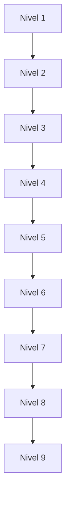

# Proyectos Finales

## Proyecto 1 — Nivel 1

Crear una consola que registre estudiantes, calcule su promedio y muestre si aprobaron.

## Proyecto 2 — Nivel 2

Modelar el sistema escolar con clases, herencia, encapsulamiento y listas simples de objetos.

## Proyecto 3 — Nivel 3

Hacer un gestor de cursos con colecciones, filtros, streams y manejo de errores.

## Proyecto 4 — Nivel 4

Agregar persistencia de archivos, serialización y una tarea concurrente simple.

## Proyecto 5 — Nivel 5

Refactorizar el proyecto anterior aplicando Clean Code, SOLID y logging.

## Proyecto 6 — Nivel 6

Usar patrones de diseño para resolver notificaciones, reportes y procesos de inscripción.

## Proyecto 7 — Nivel 7

Separar el sistema en capas o en una arquitectura hexagonal.

## Proyecto 8 — Nivel 8

Cubrir la lógica con tests unitarios, Mockito y al menos un test de integración.

## Proyecto 9 — Nivel 9

Construir una mini API con Spring Boot, validación, persistencia y endpoints REST.

## Proyecto final

Un sistema escolar completo, simple de ejecutar y con documentación clara.

La idea es que cada proyecto prepare el siguiente sin saltos bruscos.
